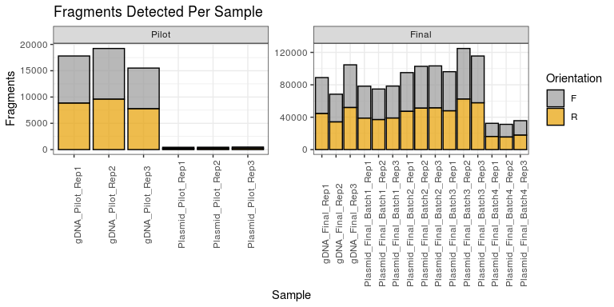
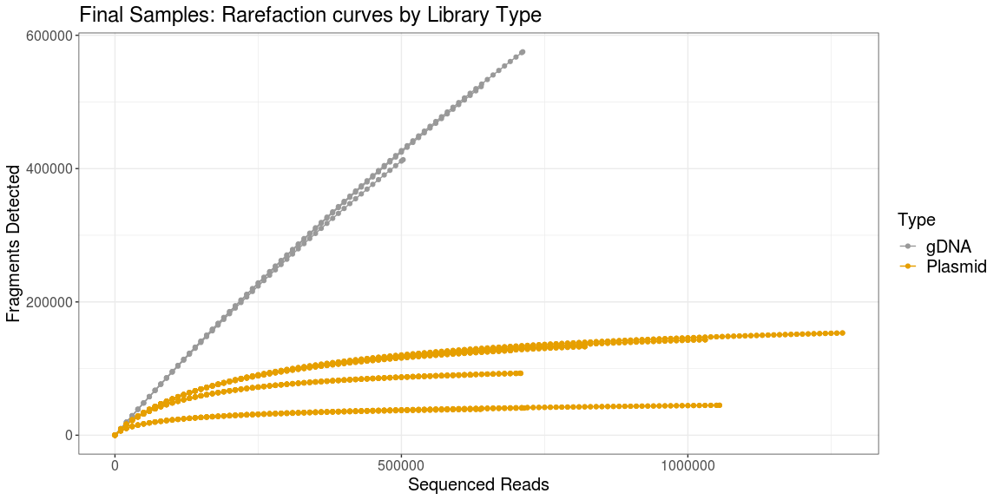

## Figure 0.0
How many fragments are there per sample?

### Note: This figure was changed to use new names
  

## Figure 0.1 saturation curves all samples
Were samples sequenced deeply enough to detect all fragments?

#### Note: Increased Font size for axes & key 

## Figure 1
### Q) Was there bias in the genomic fragmentation or in the fragments that were cloned into the library plasmid?

#### NOTE: Changed names of sample (Pilot gDNA, Pilot Plasmid, etc)
#### NOTE: Increased font size

#### NOTE: Changed names of sample (Pilot gDNA, Pilot Plasmid, etc)
#### NOTE: Increased font size

## Figure 2
## Q: Was there bias in PCR/sequencing analysis?

#### NOTE: Dropped gDNA, include final and pilot PLASMIDs only
#### NOTE: increased font size
#### NOTE: Renamed samples and used spaces in sample labels
There are 2.5 million fragments identified, this is too many for a heatmap (pheatmap gives an error), 
so a boxplot might work. There is clearly a lot of variability in read counts per fragment.

### Figure 2.1
### Another boxplot with only samples from the Final set

#### NOTE: not changed because this figure won't be used

### Figure 2.2
An attempt at a heatmap using fragments present in the largest number of samples.
This still looks terrible because the fragment matrix is so sparse.
  

#### NOTE: not changed because this figure won't be used
  

## Figure 2.3 Mapped read pairs vs number of fragments
Does higher sequencing depth lead to detecting more fragments?
(This is already answered in the saturation plots above).
### Y axis is log2

#### NOTE: Increased font size, but removed bold to match other plots.

### Y axis is linear

#### NOTE: Increased font size, but removed bold to match other plots.

The Final samples were sequenced deeply enough for the Plasmids, but the number of detected fragments
was still rapidly increasing with sequencing depth for the gDNA samples.
The story is similar for the Pilot samples, where more fragments would have been detected in the gDNA samples
if they were sequenced more deeply, but the Plasmid fragments had been fully sampled.

## Figure 3
Q: What are the sizes of the genomic fragments, and what are the sizes of the fragments 
that were cloned into the library plasmid? Was there any bias in cloning (meaning 
although there was a broader range of sizes in the genomic fragments, fragments of a narrower
range of sizes were cloned)?

#### NOTE: Increase font size

Summary statistics for fragment length
  

#### NOTE: Table written out as insert_statistics.tsv
  

<table class="table table-striped table-hover table-condensed table-responsive" style="width: auto !important; margin-left: auto; margin-right: auto;">
 <thead>
  <tr>
   <th style="text-align:left;">   </th>
   <th style="text-align:right;"> Min </th>
   <th style="text-align:right;"> Q1 </th>
   <th style="text-align:right;"> Median </th>
   <th style="text-align:right;"> Mean </th>
   <th style="text-align:right;"> Q3 </th>
   <th style="text-align:right;"> Max </th>
  </tr>
 </thead>
<tbody>
  <tr>
   <td style="text-align:left;"> Pilot.gDNA </td>
   <td style="text-align:right;"> 77 </td>
   <td style="text-align:right;"> 377 </td>
   <td style="text-align:right;"> 417 </td>
   <td style="text-align:right;"> 421.41 </td>
   <td style="text-align:right;"> 462 </td>
   <td style="text-align:right;"> 1425 </td>
  </tr>
  <tr>
   <td style="text-align:left;"> Pilot.Plasmid </td>
   <td style="text-align:right;"> 282 </td>
   <td style="text-align:right;"> 384 </td>
   <td style="text-align:right;"> 423 </td>
   <td style="text-align:right;"> 426.82 </td>
   <td style="text-align:right;"> 465 </td>
   <td style="text-align:right;"> 590 </td>
  </tr>
  <tr>
   <td style="text-align:left;"> Final.gDNA </td>
   <td style="text-align:right;"> 2 </td>
   <td style="text-align:right;"> 510 </td>
   <td style="text-align:right;"> 544 </td>
   <td style="text-align:right;"> 540.33 </td>
   <td style="text-align:right;"> 576 </td>
   <td style="text-align:right;"> 1493 </td>
  </tr>
  <tr>
   <td style="text-align:left;"> Final.Plasmid </td>
   <td style="text-align:right;"> 7 </td>
   <td style="text-align:right;"> 527 </td>
   <td style="text-align:right;"> 559 </td>
   <td style="text-align:right;"> 554.90 </td>
   <td style="text-align:right;"> 588 </td>
   <td style="text-align:right;"> 1382 </td>
  </tr>
</tbody>
</table>
Median insert for gDNA vs Plasmid is similar, and distributions are very similar. There doesn't seem to be much evidence
of significant size bias in plasmid incorporation.

## Figure 4
### How much of the genome is covered by the fragments? (Visual representation)

### Visual Representations of Genome Coverage:
#### All plots are for fragments from the combined **Final Plasmid** replicates.
#### Black bars inside of the contig represent genes in forward orientation, green bars are reverse.

#### NOTE: Modified to increase font size on the X axis.
  

The Final Plasmid fragment library provides high coverage across both genes and introns.

How does coverage look across a larger region of the genome?
  
#### NOTE: Modified to have larger font and to show only the first 5 largest contigs
#### NOTE: 2021-05-25 the font size for numbered labels on contigs from .8 to .9 

What does the spike in coverage on contig DS571153 look like up close?
#### NOTE: Font size increased on X axis

#### NOTE: This is a new figure to potentially replace the one for DS571153
Zoom in on contig1 (DS571145) only

#### NOTE: This is a new figure to potentially replace the one for DS571153
Zoom in on contig2 (DS571146) only

## Figure/Table 5, 6, 7:
Q: How much of the genome is covered by the fragments? (more in-depth analysis)?  

Q: For genes that are represented, is there 1 fragment, or more?  

Q: For genes that are represented, is the library fragment in the same orientation as the gene, or not?  

<table class="table table-striped table-hover table-condensed table-responsive" style="width: auto !important; margin-left: auto; margin-right: auto;">
 <thead>
  <tr>
   <th style="text-align:left;">   </th>
   <th style="text-align:left;"> gDNA_Pilot </th>
   <th style="text-align:left;"> Plasmid_pilot </th>
   <th style="text-align:left;"> gDNA_Final </th>
   <th style="text-align:left;"> Plasmid_Final </th>
  </tr>
 </thead>
<tbody>
  <tr>
   <td style="text-align:left;"> bpCoveredForward </td>
   <td style="text-align:left;"> 2.0e+07 </td>
   <td style="text-align:left;"> 9.3e+04 </td>
   <td style="text-align:left;"> 2.1e+07 </td>
   <td style="text-align:left;"> 2.0e+07 </td>
  </tr>
  <tr>
   <td style="text-align:left;"> pctCoveredForward </td>
   <td style="text-align:left;"> 9.6e+01 </td>
   <td style="text-align:left;"> 4.5e-01 </td>
   <td style="text-align:left;"> 9.9e+01 </td>
   <td style="text-align:left;"> 9.5e+01 </td>
  </tr>
  <tr>
   <td style="text-align:left;"> bpCoveredReverse </td>
   <td style="text-align:left;"> 2.0e+07 </td>
   <td style="text-align:left;"> 9.9e+04 </td>
   <td style="text-align:left;"> 2.0e+07 </td>
   <td style="text-align:left;"> 2.0e+07 </td>
  </tr>
  <tr>
   <td style="text-align:left;"> pctCoveredReverse </td>
   <td style="text-align:left;"> 9.6e+01 </td>
   <td style="text-align:left;"> 4.5e-01 </td>
   <td style="text-align:left;"> 9.9e+01 </td>
   <td style="text-align:left;"> 9.5e+01 </td>
  </tr>
  <tr>
   <td style="text-align:left;"> bpCoveredUnStranded </td>
   <td style="text-align:left;"> 2.0e+07 </td>
   <td style="text-align:left;"> 1.9e+05 </td>
   <td style="text-align:left;"> 2.1e+07 </td>
   <td style="text-align:left;"> 2.0e+07 </td>
  </tr>
  <tr>
   <td style="text-align:left;"> pctCoveredUnStranded </td>
   <td style="text-align:left;"> 9.8e+01 </td>
   <td style="text-align:left;"> 9.2e-01 </td>
   <td style="text-align:left;"> 9.9e+01 </td>
   <td style="text-align:left;"> 9.7e+01 </td>
  </tr>
  <tr>
   <td style="text-align:left;"> GenesTargetedStranded </td>
   <td style="text-align:left;"> 8.3e+03 </td>
   <td style="text-align:left;"> 1.5e+02 </td>
   <td style="text-align:left;"> 8.3e+03 </td>
   <td style="text-align:left;"> 8.3e+03 </td>
  </tr>
  <tr>
   <td style="text-align:left;"> GenesMissedStranded </td>
   <td style="text-align:left;"> 3.4e+01 </td>
   <td style="text-align:left;"> 8.2e+03 </td>
   <td style="text-align:left;"> 2.3e+01 </td>
   <td style="text-align:left;"> 3.1e+01 </td>
  </tr>
  <tr>
   <td style="text-align:left;"> MeanFragmentsPerGeneStranded </td>
   <td style="text-align:left;"> 2.1e+01 </td>
   <td style="text-align:left;"> 0.0e+00 </td>
   <td style="text-align:left;"> 5.9e+01 </td>
   <td style="text-align:left;"> 2.3e+01 </td>
  </tr>
  <tr>
   <td style="text-align:left;"> GenesTargetedByMultipleStranded </td>
   <td style="text-align:left;"> 8.3e+03 </td>
   <td style="text-align:left;"> 5.4e+01 </td>
   <td style="text-align:left;"> 8.3e+03 </td>
   <td style="text-align:left;"> 8.3e+03 </td>
  </tr>
  <tr>
   <td style="text-align:left;"> GenesTargetedUnStranded </td>
   <td style="text-align:left;"> 8.3e+03 </td>
   <td style="text-align:left;"> 3.0e+02 </td>
   <td style="text-align:left;"> 8.3e+03 </td>
   <td style="text-align:left;"> 8.3e+03 </td>
  </tr>
  <tr>
   <td style="text-align:left;"> GenesMissedUnStranded </td>
   <td style="text-align:left;"> 2.3e+01 </td>
   <td style="text-align:left;"> 8.0e+03 </td>
   <td style="text-align:left;"> 2.3e+01 </td>
   <td style="text-align:left;"> 2.6e+01 </td>
  </tr>
  <tr>
   <td style="text-align:left;"> MeanFragmentsPerGeneUnStranded </td>
   <td style="text-align:left;"> 4.3e+01 </td>
   <td style="text-align:left;"> 1.0e-01 </td>
   <td style="text-align:left;"> 1.2e+02 </td>
   <td style="text-align:left;"> 4.7e+01 </td>
  </tr>
  <tr>
   <td style="text-align:left;"> GenesTargetedByMultipleUnStranded </td>
   <td style="text-align:left;"> 8.3e+03 </td>
   <td style="text-align:left;"> 1.1e+02 </td>
   <td style="text-align:left;"> 8.3e+03 </td>
   <td style="text-align:left;"> 8.3e+03 </td>
  </tr>
</tbody>
</table>
Note that "GenesTargetedByMultiple" rows report the number of genes targeted by > 1 fragment.

## Figure/Table 6 & 7 Fragments per gene Heatmap:

Q: For genes that are represented, is the library fragment in the same orientation as the gene, or not?  

#### NOTE: Font size increased On X axis and in Legend, labels changed to include spaces.

## Figure 8
Q: What about the few genes that are never represented?
  

#### NOTE: Font size increased On X axis and in Legend, labels changed to include spaces.
  
  

## Tables:

### Sequencing and Fragment count statistics for Final and Pilot samples
<table class="table table-striped table-hover table-condensed table-responsive" style="width: auto !important; margin-left: auto; margin-right: auto;">
 <thead>
  <tr>
   <th style="text-align:left;"> sample </th>
   <th style="text-align:left;"> mappedPairs </th>
   <th style="text-align:left;"> fragments </th>
   <th style="text-align:left;"> Type </th>
   <th style="text-align:left;"> Rep </th>
   <th style="text-align:left;"> Group </th>
  </tr>
 </thead>
<tbody>
  <tr>
   <td style="text-align:left;"> gDNA_Pilot_Rep1 </td>
   <td style="text-align:left;"> 447,816 </td>
   <td style="text-align:left;"> 189,741 </td>
   <td style="text-align:left;"> gDNA </td>
   <td style="text-align:left;"> 1 </td>
   <td style="text-align:left;"> Pilot </td>
  </tr>
  <tr>
   <td style="text-align:left;"> gDNA_Pilot_Rep2 </td>
   <td style="text-align:left;"> 480,134 </td>
   <td style="text-align:left;"> 203,572 </td>
   <td style="text-align:left;"> gDNA </td>
   <td style="text-align:left;"> 2 </td>
   <td style="text-align:left;"> Pilot </td>
  </tr>
  <tr>
   <td style="text-align:left;"> gDNA_Pilot_Rep3 </td>
   <td style="text-align:left;"> 342,594 </td>
   <td style="text-align:left;"> 143,817 </td>
   <td style="text-align:left;"> gDNA </td>
   <td style="text-align:left;"> 3 </td>
   <td style="text-align:left;"> Pilot </td>
  </tr>
  <tr>
   <td style="text-align:left;"> Plasmid_Pilot_Rep1 </td>
   <td style="text-align:left;"> 276,964 </td>
   <td style="text-align:left;"> 472 </td>
   <td style="text-align:left;"> Plasmid </td>
   <td style="text-align:left;"> 1 </td>
   <td style="text-align:left;"> Pilot </td>
  </tr>
  <tr>
   <td style="text-align:left;"> Plasmid_Pilot_Rep2 </td>
   <td style="text-align:left;"> 399,114 </td>
   <td style="text-align:left;"> 481 </td>
   <td style="text-align:left;"> Plasmid </td>
   <td style="text-align:left;"> 2 </td>
   <td style="text-align:left;"> Pilot </td>
  </tr>
  <tr>
   <td style="text-align:left;"> Plasmid_Pilot_Rep3 </td>
   <td style="text-align:left;"> 573,080 </td>
   <td style="text-align:left;"> 540 </td>
   <td style="text-align:left;"> Plasmid </td>
   <td style="text-align:left;"> 3 </td>
   <td style="text-align:left;"> Pilot </td>
  </tr>
  <tr>
   <td style="text-align:left;"> gDNA_Final_Rep1 </td>
   <td style="text-align:left;"> 1,317,646 </td>
   <td style="text-align:left;"> 522,946 </td>
   <td style="text-align:left;"> gDNA </td>
   <td style="text-align:left;"> 1 </td>
   <td style="text-align:left;"> Final </td>
  </tr>
  <tr>
   <td style="text-align:left;"> gDNA_Final_Rep2 </td>
   <td style="text-align:left;"> 1,035,946 </td>
   <td style="text-align:left;"> 413,343 </td>
   <td style="text-align:left;"> gDNA </td>
   <td style="text-align:left;"> 2 </td>
   <td style="text-align:left;"> Final </td>
  </tr>
  <tr>
   <td style="text-align:left;"> gDNA_Final_Rep3 </td>
   <td style="text-align:left;"> 1,466,722 </td>
   <td style="text-align:left;"> 575,167 </td>
   <td style="text-align:left;"> gDNA </td>
   <td style="text-align:left;"> 3 </td>
   <td style="text-align:left;"> Final </td>
  </tr>
  <tr>
   <td style="text-align:left;"> Plasmid_Final_Batch1_Rep1 </td>
   <td style="text-align:left;"> 1,500,958 </td>
   <td style="text-align:left;"> 92,822 </td>
   <td style="text-align:left;"> Plasmid </td>
   <td style="text-align:left;"> 1 </td>
   <td style="text-align:left;"> Final </td>
  </tr>
  <tr>
   <td style="text-align:left;"> Plasmid_Final_Batch1_Rep2 </td>
   <td style="text-align:left;"> 1,318,560 </td>
   <td style="text-align:left;"> 90,347 </td>
   <td style="text-align:left;"> Plasmid </td>
   <td style="text-align:left;"> 2 </td>
   <td style="text-align:left;"> Final </td>
  </tr>
  <tr>
   <td style="text-align:left;"> Plasmid_Final_Batch1_Rep3 </td>
   <td style="text-align:left;"> 1,501,272 </td>
   <td style="text-align:left;"> 93,088 </td>
   <td style="text-align:left;"> Plasmid </td>
   <td style="text-align:left;"> 3 </td>
   <td style="text-align:left;"> Final </td>
  </tr>
  <tr>
   <td style="text-align:left;"> Plasmid_Final_Batch2_Rep1 </td>
   <td style="text-align:left;"> 1,457,526 </td>
   <td style="text-align:left;"> 126,868 </td>
   <td style="text-align:left;"> Plasmid </td>
   <td style="text-align:left;"> 1 </td>
   <td style="text-align:left;"> Final </td>
  </tr>
  <tr>
   <td style="text-align:left;"> Plasmid_Final_Batch2_Rep2 </td>
   <td style="text-align:left;"> 1,723,194 </td>
   <td style="text-align:left;"> 134,349 </td>
   <td style="text-align:left;"> Plasmid </td>
   <td style="text-align:left;"> 2 </td>
   <td style="text-align:left;"> Final </td>
  </tr>
  <tr>
   <td style="text-align:left;"> Plasmid_Final_Batch2_Rep3 </td>
   <td style="text-align:left;"> 1,740,592 </td>
   <td style="text-align:left;"> 132,963 </td>
   <td style="text-align:left;"> Plasmid </td>
   <td style="text-align:left;"> 3 </td>
   <td style="text-align:left;"> Final </td>
  </tr>
  <tr>
   <td style="text-align:left;"> Plasmid_Final_Batch3_Rep1 </td>
   <td style="text-align:left;"> 1,467,720 </td>
   <td style="text-align:left;"> 129,278 </td>
   <td style="text-align:left;"> Plasmid </td>
   <td style="text-align:left;"> 1 </td>
   <td style="text-align:left;"> Final </td>
  </tr>
  <tr>
   <td style="text-align:left;"> Plasmid_Final_Batch3_Rep2 </td>
   <td style="text-align:left;"> 2,712,002 </td>
   <td style="text-align:left;"> 153,399 </td>
   <td style="text-align:left;"> Plasmid </td>
   <td style="text-align:left;"> 2 </td>
   <td style="text-align:left;"> Final </td>
  </tr>
  <tr>
   <td style="text-align:left;"> Plasmid_Final_Batch3_Rep3 </td>
   <td style="text-align:left;"> 2,207,970 </td>
   <td style="text-align:left;"> 143,289 </td>
   <td style="text-align:left;"> Plasmid </td>
   <td style="text-align:left;"> 3 </td>
   <td style="text-align:left;"> Final </td>
  </tr>
  <tr>
   <td style="text-align:left;"> Plasmid_Final_Batch4_Rep1 </td>
   <td style="text-align:left;"> 1,588,276 </td>
   <td style="text-align:left;"> 40,770 </td>
   <td style="text-align:left;"> Plasmid </td>
   <td style="text-align:left;"> 1 </td>
   <td style="text-align:left;"> Final </td>
  </tr>
  <tr>
   <td style="text-align:left;"> Plasmid_Final_Batch4_Rep2 </td>
   <td style="text-align:left;"> 1,418,664 </td>
   <td style="text-align:left;"> 38,870 </td>
   <td style="text-align:left;"> Plasmid </td>
   <td style="text-align:left;"> 2 </td>
   <td style="text-align:left;"> Final </td>
  </tr>
  <tr>
   <td style="text-align:left;"> Plasmid_Final_Batch4_Rep3 </td>
   <td style="text-align:left;"> 2,323,702 </td>
   <td style="text-align:left;"> 44,937 </td>
   <td style="text-align:left;"> Plasmid </td>
   <td style="text-align:left;"> 3 </td>
   <td style="text-align:left;"> Final </td>
  </tr>
</tbody>
</table>

### Fragment count statistics for combined replicates
Q: How many unique fragments are there?
<table class="table table-striped table-hover table-condensed table-responsive" style="width: auto !important; margin-left: auto; margin-right: auto;">
 <thead>
  <tr>
   <th style="text-align:left;">   </th>
   <th style="text-align:left;"> gDNA_Pilot </th>
   <th style="text-align:left;"> Plasmid_Pilot </th>
   <th style="text-align:left;"> gDNA_Final </th>
   <th style="text-align:left;"> Plasmid_Final </th>
  </tr>
 </thead>
<tbody>
  <tr>
   <td style="text-align:left;"> Fragments </td>
   <td style="text-align:left;"> 537,066 </td>
   <td style="text-align:left;"> 621 </td>
   <td style="text-align:left;"> 1,509,696 </td>
   <td style="text-align:left;"> 489,981 </td>
  </tr>
</tbody>
</table>

## R session info and packages
**R version 3.6.1 (2019-07-05)**

**Platform:** x86_64-pc-linux-gnu (64-bit) 

**locale:**
_LC_CTYPE=en_US_, _LC_NUMERIC=C_, _LC_TIME=en_US_, _LC_COLLATE=en_US_, _LC_MONETARY=en_US_, _LC_MESSAGES=en_US_, _LC_PAPER=en_US_, _LC_NAME=C_, _LC_ADDRESS=C_, _LC_TELEPHONE=C_, _LC_MEASUREMENT=en_US_ and _LC_IDENTIFICATION=C_

**attached base packages:** 

* stats4 
* parallel 
* stats 
* graphics 
* grDevices 
* utils 
* datasets 
* methods 
* base 

**other attached packages:** 

* pander(v.0.6.3) 
* plyranges(v.1.6.10) 
* karyoploteR(v.1.12.4) 
* regioneR(v.1.18.1) 
* vegan(v.2.5-6) 
* lattice(v.0.20-38) 
* permute(v.0.9-5) 
* tidyr(v.1.1.2) 
* hrbrthemes(v.0.8.0) 
* BSgenome(v.1.54.0) 
* rtracklayer(v.1.46.0) 
* GenomicRanges(v.1.38.0) 
* GenomeInfoDb(v.1.22.1) 
* data.table(v.1.12.8) 
* pheatmap(v.1.0.12) 
* ggplot2(v.3.3.2) 
* readr(v.1.3.1) 
* Rsubread(v.2.0.1) 
* Biostrings(v.2.54.0) 
* XVector(v.0.26.0) 
* IRanges(v.2.20.2) 
* S4Vectors(v.0.24.4) 
* BiocGenerics(v.0.32.0) 
* kableExtra(v.1.1.0) 

**loaded via a namespace (and not attached):** 

* colorspace(v.1.4-1) 
* ellipsis(v.0.3.1) 
* htmlTable(v.1.13.3) 
* biovizBase(v.1.34.1) 
* base64enc(v.0.1-3) 
* dichromat(v.2.0-0) 
* rstudioapi(v.0.11) 
* farver(v.2.0.3) 
* bit64(v.0.9-7) 
* AnnotationDbi(v.1.48.0) 
* xml2(v.1.3.2) 
* splines(v.3.6.1) 
* extrafont(v.0.17) 
* knitr(v.1.28) 
* Formula(v.1.2-3) 
* Rsamtools(v.2.2.3) 
* Rttf2pt1(v.1.3.8) 
* cluster(v.2.1.0) 
* dbplyr(v.1.4.4) 
* png(v.0.1-7) 
* compiler(v.3.6.1) 
* httr(v.1.4.1) 
* backports(v.1.1.7) 
* lazyeval(v.0.2.2) 
* assertthat(v.0.2.1) 
* Matrix(v.1.2-17) 
* acepack(v.1.4.1) 
* htmltools(v.0.4.0) 
* prettyunits(v.1.1.1) 
* tools(v.3.6.1) 
* gtable(v.0.3.0) 
* glue(v.1.4.1) 
* GenomeInfoDbData(v.1.2.2) 
* dplyr(v.1.0.0) 
* rappdirs(v.0.3.1) 
* Rcpp(v.1.0.4.6) 
* Biobase(v.2.46.0) 
* vctrs(v.0.3.1) 
* nlme(v.3.1-140) 
* extrafontdb(v.1.0) 
* xfun(v.0.14) 
* stringr(v.1.4.0) 
* rvest(v.0.3.5) 
* lifecycle(v.0.2.0) 
* ensembldb(v.2.10.2) 
* XML(v.3.99-0.3) 
* zlibbioc(v.1.32.0) 
* MASS(v.7.3-51.4) 
* scales(v.1.1.1) 
* VariantAnnotation(v.1.32.0) 
* ProtGenerics(v.1.18.0) 
* hms(v.0.5.3) 
* SummarizedExperiment(v.1.16.1) 
* AnnotationFilter(v.1.10.0) 
* RColorBrewer(v.1.1-2) 
* yaml(v.2.2.1) 
* curl(v.4.3) 
* gridExtra(v.2.3) 
* memoise(v.1.1.0) 
* gdtools(v.0.2.2) 
* rpart(v.4.1-15) 
* biomaRt(v.2.42.1) 
* latticeExtra(v.0.6-29) 
* stringi(v.1.4.6) 
* RSQLite(v.2.2.0) 
* highr(v.0.8) 
* checkmate(v.2.0.0) 
* GenomicFeatures(v.1.38.2) 
* BiocParallel(v.1.20.1) 
* rlang(v.0.4.6) 
* pkgconfig(v.2.0.3) 
* systemfonts(v.0.2.3) 
* matrixStats(v.0.56.0) 
* bitops(v.1.0-6) 
* evaluate(v.0.14) 
* purrr(v.0.3.4) 
* htmlwidgets(v.1.5.1) 
* GenomicAlignments(v.1.22.1) 
* labeling(v.0.3) 
* bit(v.1.1-15.2) 
* tidyselect(v.1.1.0) 
* magrittr(v.1.5) 
* R6(v.2.4.1) 
* generics(v.0.0.2) 
* Hmisc(v.4.4-0) 
* DelayedArray(v.0.12.3) 
* DBI(v.1.1.0) 
* foreign(v.0.8-71) 
* pillar(v.1.4.4) 
* withr(v.2.2.0) 
* mgcv(v.1.8-28) 
* nnet(v.7.3-12) 
* survival(v.3.1-12) 
* RCurl(v.1.98-1.2) 
* tibble(v.3.0.1) 
* crayon(v.1.3.4) 
* BiocFileCache(v.1.10.2) 
* rmarkdown(v.2.2) 
* jpeg(v.0.1-8.1) 
* bamsignals(v.1.18.0) 
* progress(v.1.2.2) 
* grid(v.3.6.1) 
* blob(v.1.2.1) 
* digest(v.0.6.25) 
* webshot(v.0.5.2) 
* bezier(v.1.1.2) 
* openssl(v.1.4.1) 
* munsell(v.0.5.0) 
* viridisLite(v.0.3.0) 
* askpass(v.1.1) 
