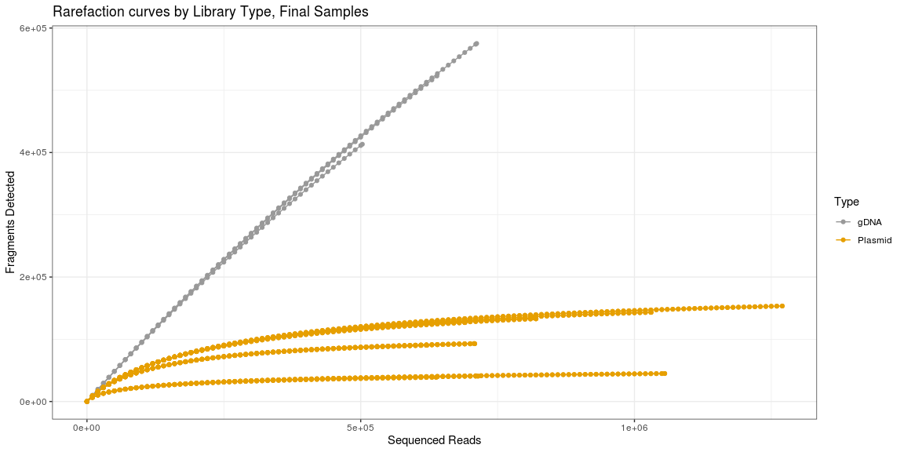
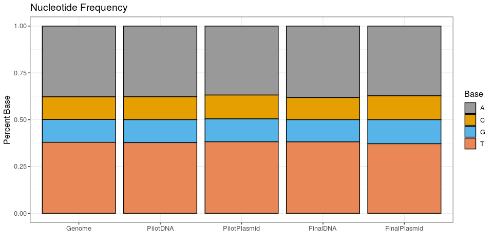
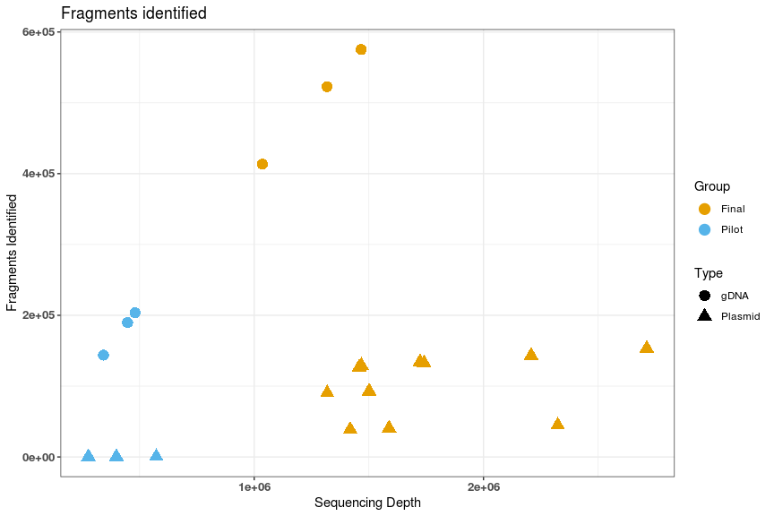
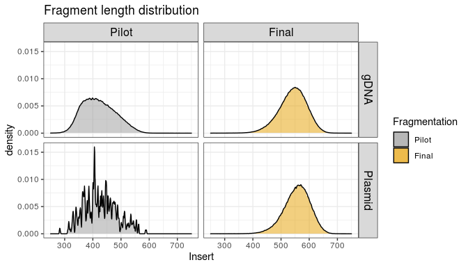
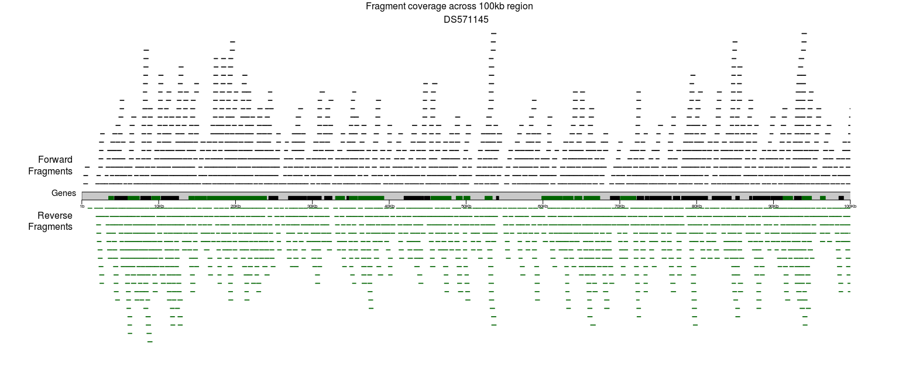
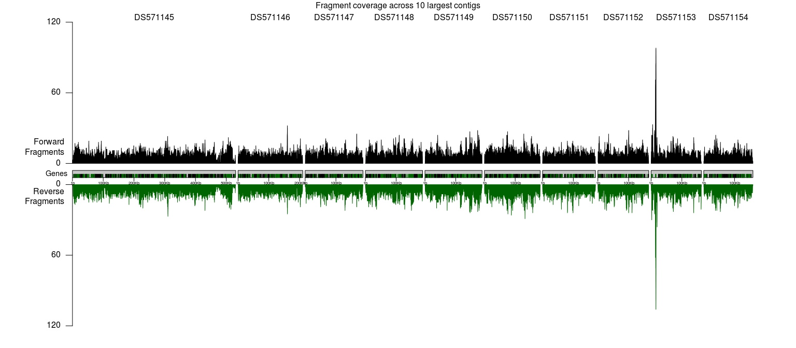

## Figure 0.0
How many fragments are there per sample?

## Figure 0.1 
Were samples sequenced deeply enough to detect all fragments?

## Figure 1
### Q) Was there bias in the genomic fragmentation or in the fragments that were cloned into the library plasmid?

## Figure 2
## Q: Was there bias in PCR/sequencing analysis?

There are 2.5 identified fragments, this is too many for a heatmap (pheatmap gives an error), 
so a boxplot might work. There is clearly a lot of variability in read counts per fragment.

### Figure 2.1
### Another boxplot with only samples from the Final set

### Figure 2.2
An attempt at a heatmap using fragments present in the largest number of samples.
This still looks terrible because the fragment matrix is so sparse.

## Figure 2.3 Mapped read pairs vs number of fragments
Does higher sequencing depth lead to detecting more fragments?
(This is already answered in the saturation plots above).

The Final samples were sequenced deeply enough for the Plasmids, but the number of detected fragments
was still rapidly increasing with sequencing depth for the gDNA samples.
The story is similar for the Pilot samples, where more fragments would have been detected in the gDNA samples
if they were sequenced more deeply, but the Plasmid fragments had been fully sampled.

## Figure 3
Q: What are the sizes of the genomic fragments, and what are the sizes of the fragments 
that were cloned into the library plasmid? Was there any bias in cloning (meaning 
although there was a broader range of sizes in the genomic fragments, fragments of a narrower
range of sizes were cloned)?

Summary statistics for fragment length
<table class="table table-striped table-hover table-condensed table-responsive" style="width: auto !important; margin-left: auto; margin-right: auto;">
 <thead>
  <tr>
   <th style="text-align:left;">   </th>
   <th style="text-align:right;"> Min </th>
   <th style="text-align:right;"> Q1 </th>
   <th style="text-align:right;"> Median </th>
   <th style="text-align:right;"> Mean </th>
   <th style="text-align:right;"> Q3 </th>
   <th style="text-align:right;"> Max </th>
  </tr>
 </thead>
<tbody>
  <tr>
   <td style="text-align:left;"> Pilot.gDNA </td>
   <td style="text-align:right;"> 77 </td>
   <td style="text-align:right;"> 377 </td>
   <td style="text-align:right;"> 417 </td>
   <td style="text-align:right;"> 421.4145 </td>
   <td style="text-align:right;"> 462 </td>
   <td style="text-align:right;"> 1425 </td>
  </tr>
  <tr>
   <td style="text-align:left;"> Pilot.Plasmid </td>
   <td style="text-align:right;"> 282 </td>
   <td style="text-align:right;"> 384 </td>
   <td style="text-align:right;"> 423 </td>
   <td style="text-align:right;"> 426.8165 </td>
   <td style="text-align:right;"> 465 </td>
   <td style="text-align:right;"> 590 </td>
  </tr>
  <tr>
   <td style="text-align:left;"> Final.gDNA </td>
   <td style="text-align:right;"> 2 </td>
   <td style="text-align:right;"> 510 </td>
   <td style="text-align:right;"> 544 </td>
   <td style="text-align:right;"> 540.3260 </td>
   <td style="text-align:right;"> 576 </td>
   <td style="text-align:right;"> 1493 </td>
  </tr>
  <tr>
   <td style="text-align:left;"> Final.Plasmid </td>
   <td style="text-align:right;"> 7 </td>
   <td style="text-align:right;"> 527 </td>
   <td style="text-align:right;"> 559 </td>
   <td style="text-align:right;"> 554.9050 </td>
   <td style="text-align:right;"> 588 </td>
   <td style="text-align:right;"> 1382 </td>
  </tr>
</tbody>
</table>
Median insert for the two groups is similar, and distributions are very similar. There doesn't seem to be much evidence
of significant size bias in plasmid incorporation.

## Figure 4
How much of the genome is covered by the fragments? (Visual representation)

### TODO: Compute coverage across the whole genome for combined Final.Plasmid.
What % of the genome is covered (forward, reverse, both)?
What % of the exons are covered (forward, reverse, both)?
What % of the introns are covered (forward, reverse, both)? 

### Visual Representations of Genome Coverage:
#### All plots are for fragments from the combined Final Plasmid replicates.
#### Black bars inside of the contig represent genes in forward orientation, green bars are reverse.

The Final Plasmid fragment library provides high coverage across both genes and introns.

How does coverage look across a larger region of the genome?

What does the spike in coverage on contig DS571153 look like up close?
<!-- -->
TODO zoom in on the 9th contig, what does the huge spike look like up close in a Geneious plot?
It would be interesting to see reads + intervals mapped.

## R session info and packages
**R version 3.6.1 (2019-07-05)**

**Platform:** x86_64-pc-linux-gnu (64-bit) 

**locale:**
_LC_CTYPE=en_US_, _LC_NUMERIC=C_, _LC_TIME=en_US_, _LC_COLLATE=en_US_, _LC_MONETARY=en_US_, _LC_MESSAGES=en_US_, _LC_PAPER=en_US_, _LC_NAME=C_, _LC_ADDRESS=C_, _LC_TELEPHONE=C_, _LC_MEASUREMENT=en_US_ and _LC_IDENTIFICATION=C_

**attached base packages:** 

* stats4 
* parallel 
* stats 
* graphics 
* grDevices 
* utils 
* datasets 
* methods 
* base 

**other attached packages:** 

* pander(v.0.6.3) 
* karyoploteR(v.1.12.4) 
* regioneR(v.1.18.1) 
* vegan(v.2.5-6) 
* lattice(v.0.20-38) 
* permute(v.0.9-5) 
* gridExtra(v.2.3) 
* hrbrthemes(v.0.8.0) 
* viridis(v.0.5.1) 
* viridisLite(v.0.3.0) 
* BSgenome(v.1.54.0) 
* rtracklayer(v.1.46.0) 
* GenomicRanges(v.1.38.0) 
* GenomeInfoDb(v.1.22.1) 
* forcats(v.0.5.0) 
* stringr(v.1.4.0) 
* dplyr(v.0.8.5) 
* purrr(v.0.3.4) 
* tidyr(v.1.0.2) 
* tibble(v.3.0.1) 
* tidyverse(v.1.3.0) 
* data.table(v.1.12.8) 
* pheatmap(v.1.0.12) 
* ggplot2(v.3.3.0) 
* readr(v.1.3.1) 
* Rsubread(v.2.0.1) 
* Biostrings(v.2.54.0) 
* XVector(v.0.26.0) 
* IRanges(v.2.20.2) 
* S4Vectors(v.0.24.2) 
* BiocGenerics(v.0.32.0) 
* kableExtra(v.1.1.0) 

**loaded via a namespace (and not attached):** 

* readxl(v.1.3.1) 
* backports(v.1.1.6) 
* Hmisc(v.4.4-0) 
* BiocFileCache(v.1.10.2) 
* systemfonts(v.0.2.1) 
* lazyeval(v.0.2.2) 
* splines(v.3.6.1) 
* BiocParallel(v.1.20.1) 
* digest(v.0.6.25) 
* ensembldb(v.2.10.2) 
* htmltools(v.0.4.0) 
* fansi(v.0.4.1) 
* checkmate(v.2.0.0) 
* magrittr(v.1.5) 
* memoise(v.1.1.0) 
* cluster(v.2.1.0) 
* modelr(v.0.1.6) 
* extrafont(v.0.17) 
* matrixStats(v.0.56.0) 
* extrafontdb(v.1.0) 
* askpass(v.1.1) 
* prettyunits(v.1.1.1) 
* jpeg(v.0.1-8.1) 
* colorspace(v.1.4-1) 
* blob(v.1.2.1) 
* rvest(v.0.3.5) 
* rappdirs(v.0.3.1) 
* haven(v.2.2.0) 
* xfun(v.0.13) 
* crayon(v.1.3.4) 
* RCurl(v.1.95-4.13) 
* jsonlite(v.1.6.1) 
* survival(v.3.1-12) 
* VariantAnnotation(v.1.32.0) 
* glue(v.1.3.2) 
* gtable(v.0.3.0) 
* zlibbioc(v.1.32.0) 
* webshot(v.0.5.2) 
* DelayedArray(v.0.12.2) 
* Rttf2pt1(v.1.3.8) 
* scales(v.1.1.0) 
* bezier(v.1.1.2) 
* DBI(v.1.1.0) 
* Rcpp(v.1.0.4.6) 
* htmlTable(v.1.13.3) 
* progress(v.1.2.2) 
* foreign(v.0.8-71) 
* bit(v.1.1-15.2) 
* Formula(v.1.2-3) 
* htmlwidgets(v.1.5.1) 
* httr(v.1.4.1) 
* RColorBrewer(v.1.1-2) 
* acepack(v.1.4.1) 
* ellipsis(v.0.3.0) 
* pkgconfig(v.2.0.3) 
* XML(v.3.99-0.3) 
* farver(v.2.0.3) 
* nnet(v.7.3-12) 
* dbplyr(v.1.4.2) 
* tidyselect(v.1.0.0) 
* labeling(v.0.3) 
* rlang(v.0.4.5) 
* AnnotationDbi(v.1.48.0) 
* munsell(v.0.5.0) 
* cellranger(v.1.1.0) 
* tools(v.3.6.1) 
* cli(v.2.0.2) 
* generics(v.0.0.2) 
* RSQLite(v.2.2.0) 
* broom(v.0.5.5) 
* evaluate(v.0.14) 
* yaml(v.2.2.1) 
* knitr(v.1.28) 
* bit64(v.0.9-7) 
* fs(v.1.3.2) 
* AnnotationFilter(v.1.10.0) 
* nlme(v.3.1-140) 
* xml2(v.1.2.5) 
* biomaRt(v.2.42.1) 
* compiler(v.3.6.1) 
* rstudioapi(v.0.11) 
* curl(v.4.3) 
* png(v.0.1-7) 
* reprex(v.0.3.0) 
* stringi(v.1.4.5) 
* highr(v.0.8) 
* GenomicFeatures(v.1.38.2) 
* gdtools(v.0.2.2) 
* ProtGenerics(v.1.18.0) 
* Matrix(v.1.2-17) 
* vctrs(v.0.2.4) 
* pillar(v.1.4.3) 
* lifecycle(v.0.2.0) 
* bitops(v.1.0-6) 
* R6(v.2.4.1) 
* latticeExtra(v.0.6-29) 
* dichromat(v.2.0-0) 
* MASS(v.7.3-51.4) 
* assertthat(v.0.2.1) 
* SummarizedExperiment(v.1.16.1) 
* openssl(v.1.4.1) 
* withr(v.2.1.2) 
* GenomicAlignments(v.1.22.1) 
* Rsamtools(v.2.2.3) 
* GenomeInfoDbData(v.1.2.2) 
* mgcv(v.1.8-28) 
* hms(v.0.5.3) 
* rpart(v.4.1-15) 
* grid(v.3.6.1) 
* bamsignals(v.1.18.0) 
* rmarkdown(v.2.1) 
* biovizBase(v.1.34.1) 
* Biobase(v.2.46.0) 
* lubridate(v.1.7.8) 
* base64enc(v.0.1-3) 
